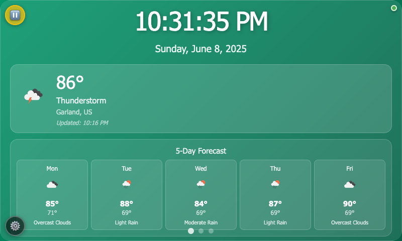

# Pi Dashboard

A modern, touch-friendly dashboard designed for Raspberry Pi touchscreens. Features weather forecasting, calendar integration, and Philips Hue smart lighting controls with automatic page cycling.



## Features

- **Weather Integration**: Real-time weather data and 5-day forecast using OpenWeatherMap API
- **Calendar Display**: Support for iCal/ICS calendar sources (Google Calendar, Apple iCloud, etc.)
- **Philips Hue Control**: Smart lighting controls with brightness adjustment and scene selection
- **Touch-Friendly Interface**: Optimized for touchscreen interaction with gesture navigation
- **Auto-Cycling Pages**: Automatic rotation between different dashboard views
- **Responsive Design**: Adapts to different screen sizes (optimized for 800x480)
- **Admin Panel**: Web-based configuration interface
- **Docker Support**: Easy deployment with Docker Compose

## Quick Start

### Using Docker (Recommended)

1. **Clone the repository**
   ```bash
   git clone https://github.com/yourusername/pi-dashboard.git
   cd pi-dashboard
   ```

2. **Configure your settings**
   ```bash
   cp data/settings.example.json data/settings.json
   # Edit data/settings.json with your API keys and preferences
   ```

3. **Start the dashboard**
   ```bash
   docker-compose up -d
   ```

4. **Access the dashboard**
   - Dashboard: http://localhost:3000
   - Admin Panel: http://localhost:3000/admin

### Manual Installation

1. **Prerequisites**
   - Node.js 18+ 
   - npm

2. **Install dependencies**
   ```bash
   npm install
   ```

3. **Configure environment**
   ```bash
   cp .env.example .env
   # Edit .env with your configuration
   ```

4. **Start the application**
   ```bash
   npm start
   ```

## Configuration

### Required API Keys

1. **OpenWeatherMap API Key** (Free)
   - Sign up at [OpenWeatherMap](https://openweathermap.org/api)
   - Get your free API key
   - Add to `data/settings.json` or `.env` file

### Optional Integrations

2. **Philips Hue Bridge** (Optional)
   - Ensure your Hue Bridge is on the same network
   - Use the admin panel to discover and connect to your bridge

3. **Calendar Sources** (Optional)
   - Add iCal/ICS URLs in the admin panel
   - Supports Google Calendar, Apple iCloud, Outlook, etc.

### Settings Configuration

Edit `data/settings.json`:

```json
{
  "settings": {
    "city": "YourCity,US",
    "weatherApiKey": "your_api_key",
    "hueBridgeIp": "192.168.1.xxx",
    "hueUsername": "your_hue_username",
    "calendarSources": [
      {
        "name": "My Calendar",
        "url": "https://calendar-url-here",
        "color": "#3498db",
        "enabled": true
      }
    ]
  }
}
```

## Hardware Setup

### Raspberry Pi Configuration

**Recommended Hardware:**
- Raspberry Pi 4B (2GB+ RAM)
- 7" touchscreen display (800x480)
- MicroSD card (16GB+)

**Software Setup:**
1. Install Raspberry Pi OS
2. Install Docker and Docker Compose
3. Configure auto-start (see [docs/raspberry-pi-setup.md](docs/raspberry-pi-setup.md))

### Touch Gestures

- **Swipe Left/Right**: Navigate between pages
- **Tap**: Interact with controls
- **Long Press**: Access additional options (where available)

## Development

### Project Structure

```
pi-dashboard/
├── src/
│   ├── client/           # Frontend code
│   │   ├── dashboard/    # Main dashboard interface
│   │   └── admin/        # Admin configuration panel
│   ├── server/           # Backend Node.js server
│   │   ├── routes/       # API routes
│   │   └── services/     # Business logic services
│   └── shared/           # Shared utilities
├── data/                 # User data and settings (gitignored)
├── uploads/              # File uploads (gitignored)
└── docs/                 # Documentation
```

### Available Scripts

```bash
npm start           # Start production server
npm run dev         # Start development server with auto-reload
npm run docker:up   # Start with Docker Compose
npm run docker:down # Stop Docker services
```

### API Endpoints

- `GET /api/weather` - Weather data and forecast
- `GET /api/calendar` - Calendar events
- `GET /api/hue/*` - Philips Hue controls
- `GET /admin` - Configuration interface

## Contributing

1. Fork the repository
2. Create a feature branch (`git checkout -b feature/amazing-feature`)
3. Commit your changes (`git commit -m 'Add amazing feature'`)
4. Push to the branch (`git push origin feature/amazing-feature`)
5. Open a Pull Request

## Security

- Never commit API keys or personal data
- Use environment variables for sensitive configuration
- The `data/` directory is automatically excluded from git
- Review `.gitignore` before committing

## Troubleshooting

### Common Issues

**Weather not loading:**
- Verify your OpenWeatherMap API key is valid
- Check the city format (e.g., "Dallas,US")
- New API keys can take up to 2 hours to activate

**Hue lights not responding:**
- Ensure the Hue Bridge is on the same network
- Press the bridge button when prompted during setup
- Check the bridge IP address in settings

**Calendar not displaying:**
- Verify the iCal/ICS URL is publicly accessible
- Check calendar permissions and sharing settings
- Some corporate calendars may block external access

## License

This project is licensed under the MIT License - see the [LICENSE](LICENSE) file for details.

## Acknowledgments

- Weather data provided by [OpenWeatherMap](https://openweathermap.org/)
- Icons and design inspired by modern dashboard interfaces
- Built for the Raspberry Pi community